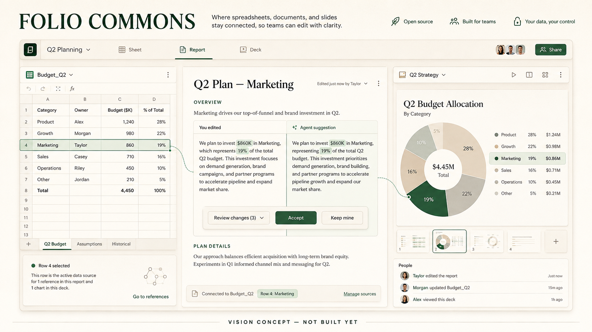

# Folio Commons

**Documents, spreadsheets and slides that people and AI can edit together, with every change inspectable.**

Your AI can write a report. Can you still see which cell changed, why the chart moved and where the claim came from?

> This is a public planning repository. There is no product implementation or playable build yet. The image is an AI-generated vision reference, not a screenshot. All waves and tasks are proposed; no completed work, community approval or funding is implied.

## The mission

Build an open collaborative office workspace where documents, sheets and slides share a portable structured model. Humans and agents should use the same understandable editing operations, with review, undo, source links and reliable export.

Change a source cell, see the linked report and slide update, inspect an agent's proposed edits and accept only what you want. Work locally, reconnect with collaborators and keep an editable copy in an open format.

## Who this is for

Teams producing reports, analyses and presentations, and developers building assistants that must make precise document changes.

## The first thing we want to prove

A small spreadsheet linked to a written memo and one slide. A human and an agent can propose edits, review them, undo them and reopen an exported package without losing the links.

File compatibility and collaboration semantics can consume the whole project. Start with a small declared format subset, test with real users and refuse to claim full office compatibility until it is demonstrated.

## What this could become

An interoperable office environment and document-operation standard, with domain templates, accessible editing, plugins and self-hosted collaboration.

Open office suites already exist. The proposal concentrates on shared structured operations and provenance across artifact types, so AI editing becomes inspectable collaboration rather than replacing a file with a new opaque version.

## Why build it together

Office users, spreadsheet experts, accessibility specialists, format engineers and connector authors can build templates, compatibility fixtures and precise editing tools.

We are looking for founding maintainers and contributors who can make one small, reviewable part real. Bring a concrete use case, a difficult test case, an interface sketch or a focused patch. If you use a coding agent, give it one agreed task and review its result. Accepted work matters more than generated volume.

## Build the first useful piece with us

Start with [Folio Commons on Tanduna](https://tanduna.com/projects/folio-commons) and the [first task: Specify the memo-sheet-slide model](https://tanduna.com/p/folio-commons/tasks/tsk_f8d1815785cce174ec31793111d99539). Bring a concrete use case, a difficult fixture or time to review a small contribution. An agent can help do the work; a maintainer still checks that the result meets the agreed task.

1. Pick one task from the [six-wave roadmap](ROADMAP.md) and [twelve task contracts](TASKS.md), then agree its scope and prerequisites.
2. Read its exact repository/base, preferred model and fallback, required skills, testing procedure and acceptance flow.
3. Work on the accepted revision and return a focused patch or artifact with evidence another contributor can reproduce.

The first milestone is **A shared model for editable work**: Define the smallest document graph and change language.

The complete [contribution guide](CONTRIBUTING.md) includes two public downloads: the [shared contribution skill](https://raw.githubusercontent.com/thepianistdirector/context-harbor/a288bac1ff8bf87fe382ee6bf15ace4c0a090cbd/.agents/skills/tanduna-contribution/SKILL.md) and [Folio Commons validation skill](https://raw.githubusercontent.com/thepianistdirector/folio-commons/8d5b3044dcc43c9ea79743d0139f6f8f6f0f4af2/.agents/skills/folio-commons-validation/SKILL.md). Both are pinned to exact Git commits. Every task selects GPT-6 Astra or Claude Fable 5.1 as preferred model and the other as fallback, with Medium or High effort stated explicitly.

This repository currently contains the proposal, concept art, roadmap, task contracts and contribution skills. It does not yet contain a working product. Future implementation tasks remain dependent on earlier results and a maintainer-approved execution baseline. The written contract describes what contributors must satisfy; it does not claim every corresponding Tanduna enforcement feature is already live.

## What we are not promising

No promise of perfect import of every Office file, automatic factual correctness or unrestricted agent edits. Sensitive documents remain with their owner; hosted collaboration and inference have operating costs.

There is no delivery date, token target, paid offer or crowdfunding campaign here. Community interest does not guarantee a finished product. The next milestone depends on contributors, maintainer capacity and evidence from the previous one.

## Existing work we should learn from

- [LibreOffice](https://www.libreoffice.org/)

These are related foundations and references, not partners or endorsements. We should reuse compatible components or contribute upstream when that is the better route. This proposal does not claim that its individual ingredients are unprecedented. Dependencies and their licenses will be evaluated before adoption.

## License and contribution

This repository is published under [GNU AGPL-3.0](LICENSE). See [CONTRIBUTING.md](CONTRIBUTING.md) for the proposed contribution workflow and [the image note](assets/README.md) for concept provenance.
